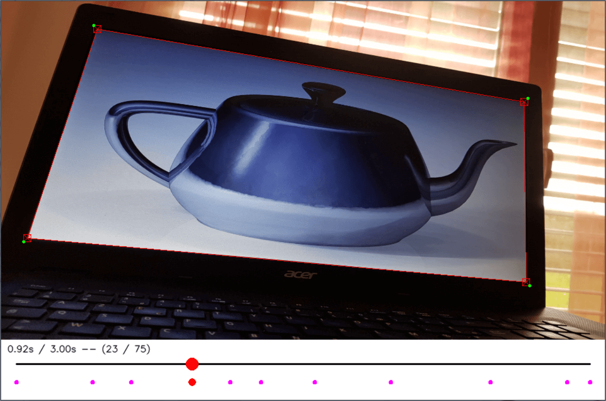

video-perspective-cropping
===

Provides a simple interface to extract a quadrilateral from a video into a warped rectangular video.
Allows the input and modification of keypoints.
The keypoints are then linearly interpolated.
Useful to extract the content of a screen filmed by a camera.

  

